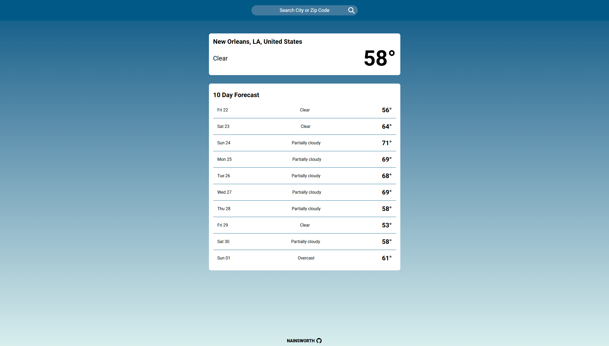

# The Odin Project - Weather App

This is my submitted project for [Project: Weather App](https://www.theodinproject.com/lessons/node-path-javascript-weather-app).

## Table of contents

- [Overview](#overview)
  - [The challenge](#the-challenge)
  - [Screenshot](#screenshot)
  - [Links](#links)
- [Author](#author)

## Overview

### The challenge

Connecting to a weather api to see current weather on searchable locations

### Screenshot

### Links

- Live Site URL: [https://nainsworth.github.io/weather-app/](https://nainsworth.github.io/weather-app/)

## Author

- GitHub - [nainsworth](https://github.com/nainsworth)
- LinkedIn - [@nicholas-ainsworth](https://www.linkedin.com/in/nicholas-ainsworth/)